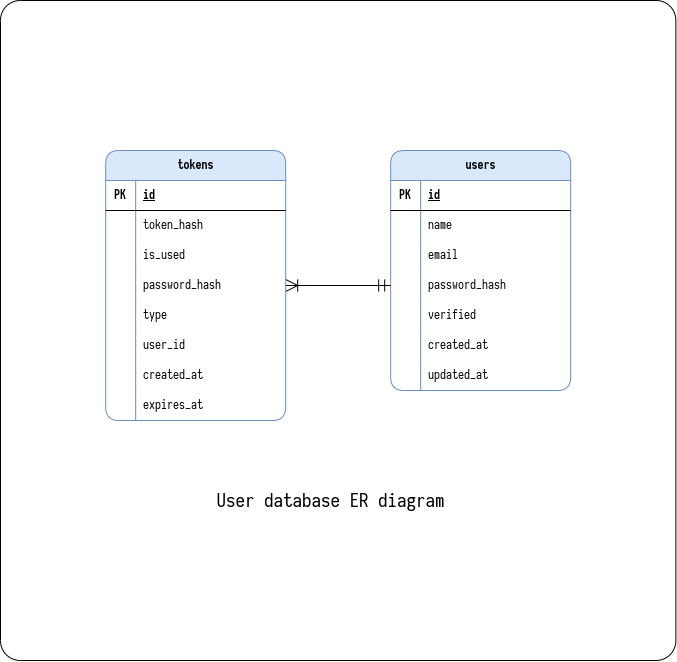
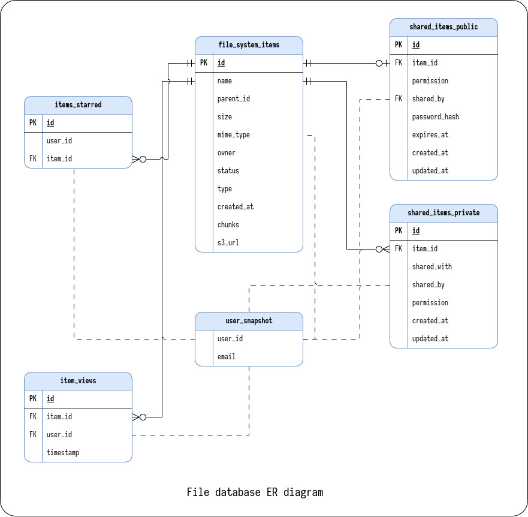
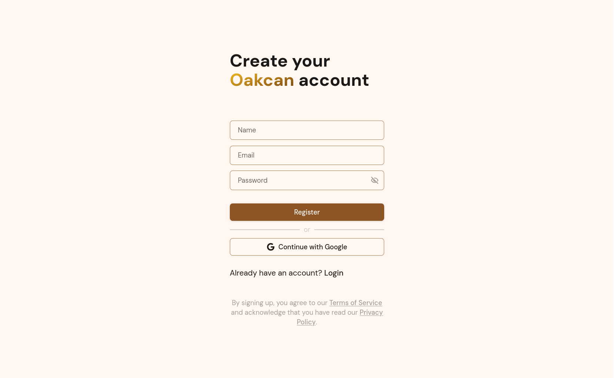
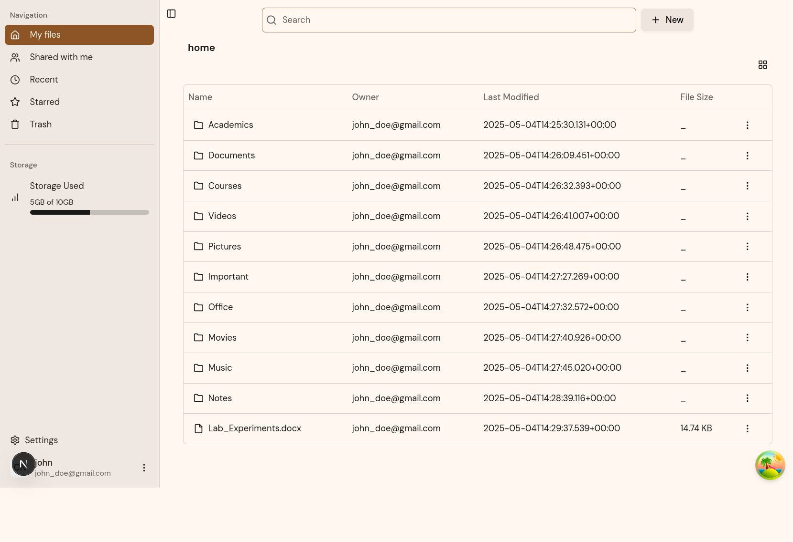
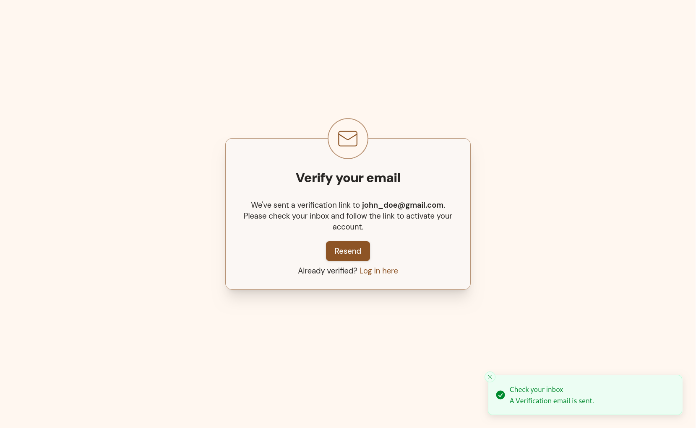
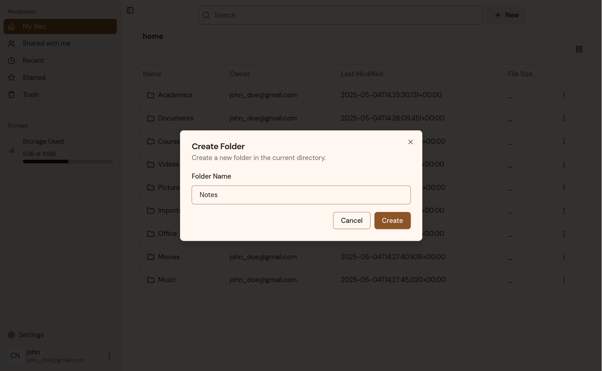

<div align="left">


[](https://github.com/Learnathon-By-Geeky-Solutions/byte-bandit/actions/workflows/frontend-ci-cd.yaml)
[](https://github.com/Learnathon-By-Geeky-Solutions/byte-bandit/actions/workflows/publish-docs.yml)
[](https://github.com/Learnathon-By-Geeky-Solutions/byte-bandit/actions/workflows/backend-ci-cd.yml)
[](https://sonarcloud.io/summary/new_code?id=Learnathon-By-Geeky-Solutions_byte-bandit)
[](https://sonarcloud.io/summary/new_code?id=Learnathon-By-Geeky-Solutions_byte-bandit)
[](https://github.com/Learnathon-By-Geeky-Solutions/byte-bandit/actions/workflows/backend-ci-cd.yml)
[](https://sonarcloud.io/summary/new_code?id=Learnathon-By-Geeky-Solutions_byte-bandit)

Oakcan is a microservice-based file management platform prototype built for learning and practicing modern software development best practices. This project focuses on mastering essential development skills including writing comprehensive tests, implementing quality checks, practicing GitHub collaboration workflows, conducting code reviews, and maintaining high code coverage standards. It demonstrates microservices patterns, Spring Boot development, and full-stack application design while providing a foundation for understanding cloud-native file management concepts.

</div>


## Quick Links

- [📚 Documentation](https://oakcan-docs.pages.dev/) - Comprehensive project documentation
- [🚀 Local Setup](https://oakcan-docs.pages.dev/get-started/local-setup/) - How to run the project locally
- [📋 GitHub Projects](https://github.com/orgs/Learnathon-By-Geeky-Solutions/projects/14) - Project management and tracking
- [🔍 SonarCloud Analysis](https://sonarcloud.io/summary/new_code?id=Learnathon-By-Geeky-Solutions_byte-bandit) - Code quality metrics
- [📋 Functional Requirements](https://oakcan-docs.pages.dev/documentation/requirements/functional-requirements/) - Detailed feature specifications
- [⚡ Non-Functional Requirements](https://oakcan-docs.pages.dev/documentation/requirements/non-functional-requirements/) - Performance and quality standards
- [🖼️ Application Screenshots](https://oakcan-docs.pages.dev/documentation/screenshots/) - Visual interface showcase

## Architecture

Oakcan follows a microservices architecture pattern designed for scalability, maintainability, and learning modern distributed systems concepts. The architecture is built around the principle of service independence while maintaining coordinated communication through well-defined interfaces.

### Core Components

- **API Gateway**: Centralized routing, authentication, and request handling. Acts as the single entry point for all client requests, implementing security filters, CORS policies, and request routing to appropriate microservices.

- **User Service**: Handles user lifecycle management including registration, authentication, email verification, and profile management. Manages JWT token generation and validation, and publishes user events to Kafka for other services to consume.

- **File Service**: Manages the complete file system operations including file/folder CRUD operations, permissions, sharing mechanisms, and integration with AWS S3 for file storage. Maintains its own database with user snapshots received via Kafka events.

- **Discovery Server**: Eureka-based service discovery that enables dynamic service registration and discovery. Provides a dashboard for monitoring service health and availability across the microservices ecosystem.

- **Config Server**: Centralized configuration management using Spring Cloud Config. Stores configuration files for all services, enabling environment-specific configurations and dynamic updates without service restarts.

### System Architecture


### Architecture Patterns & Communication

**Event-Driven Communication**: Services communicate asynchronously through Apache Kafka, particularly for user lifecycle events. When a user verifies their email, the User Service publishes a `USER_VERIFIED` event that the File Service consumes to create user snapshots and home directories.

**Database Per Service**: Each service maintains its own database schema, ensuring data isolation and service independence. The User Service database handles authentication and user management, while the File Service database manages file system operations and permissions.

**API-First Design**: All services expose RESTful APIs with OpenAPI/Swagger documentation, enabling easy integration and testing. The API Gateway provides unified access to these services with consistent authentication and authorization.

**Containerized Deployment**: All services are containerized using Docker, with orchestration handled by Docker Compose for local development and testing environments.

## Data Model

### User Service Database


The User Service maintains its own database for user management, authentication, and email verification. It handles user registration, login, and sends events to other services via Kafka when user state changes.

### File Service Database  


The File Service operates on a separate database optimized for file system operations. It maintains user snapshots (received via Kafka events) and manages the hierarchical file structure with permissions and sharing capabilities.

## Technology Stack

- **Backend**: Spring Boot, Spring Cloud Gateway, Spring Security
- **Database**: PostgreSQL with Flyway migrations
- **Storage**: AWS S3 for file storage
- **Frontend**: Next.js 14, TypeScript, Tailwind CSS
- **Authentication**: JWT tokens, Google OAuth2
- **Containerization**: Docker with Docker Compose
- **CI/CD**: GitHub Actions
- **Code Quality**: SonarCloud analysis, Checkstyle
- **Testing**: JUnit 5, Mockito, Testcontainers, JaCoCo coverage
- **Event Streaming**: Apache Kafka

## Implemented Features

### Authentication & User Management
- User registration with email verification
- Email/password authentication
- Google OAuth2 integration
- JWT-based session management
- CSRF protection

### File Operations
- File and folder creation
- File upload via presigned S3 URLs
- File and folder renaming
- File and folder moving
- Hierarchical file structure navigation
- File metadata management

### Sharing & Permissions
- Private sharing with specific users
- Public sharing infrastructure (creation and storage)
- Role-based access control (View, Edit, Comment)
- Permission inheritance for nested items

### User Interface
- Modern, responsive web interface
- File explorer with table view
- Breadcrumb navigation
- File action menus
- Mobile-responsive design

## Planned Features

### File Management
- File download functionality
- File deletion and trash system
- File previews for supported formats
- Resumable uploads and downloads
- File categorization and tagging

### Advanced Sharing
- Shareable link expiration dates
- Password-protected sharing
- Access tracking and analytics
- Bulk sharing operations

### Security & User Experience
- Two-factor authentication
- Password reset functionality
- User profile management
- Advanced permission controls
- Audit logging
- Rate limiting and API throttling
- Per-user storage quotas and limits
- File size restrictions and validation

## Getting Started

### Prerequisites
- Docker and Docker Compose
- Git

### Quick Start

1. Clone the repository:
```bash
git clone https://github.com/Learnathon-By-Geeky-Solutions/byte-bandit.git
cd byte-bandit
```

2. Set up environment variables:
```bash
cp .env.example .env
# Edit .env with your configuration (see detailed setup guide)
```

3. Start all services:
```bash
chmod +x run-services.sh
./run-services.sh start all
```

4. Access the application:
- Frontend: http://localhost:3000
- API Gateway: http://localhost:8084
- Documentation: http://localhost:8000
- Service Dashboard: http://localhost:8761

**For detailed setup instructions, environment configuration, and troubleshooting, see our [Local Setup Guide](https://oakcan-docs.pages.dev/get-started/local-setup/).**

## Screenshots

<div align="center">

|  |  |
|:--:|:--:|
| **User Registration** | **File Management Interface** |

|  |  |
|:--:|:--:|
| **Email Verification** | **Folder Management** |

</div>

*[View all screenshots →](https://oakcan-docs.pages.dev/documentation/screenshots/)*

## API Documentation

Comprehensive API documentation is available online with interactive Swagger UI at [https://oakcan-docs.pages.dev/api/reference/gateway/](https://oakcan-docs.pages.dev/api/reference/gateway/). The API follows RESTful principles and includes:

- Authentication endpoints
- File management operations
- User management
- Sharing and permissions

You can explore and test the APIs directly from the documentation without needing to run the services locally.

## Development

### Project Structure
```
apps/
├── backend/           # Backend microservices
│   ├── gateway/      # API Gateway service
│   ├── user-service/ # User management service
│   ├── file-service/ # File operations service
│   └── common/       # Shared libraries
├── web/              # Next.js frontend application
└── docs/             # Project documentation
```

### Contributing

We welcome contributions! Please read our development guidelines before contributing:

1. Fork the repository
2. Create a feature branch: `git checkout -b feature/amazing-feature`
3. Commit your changes: `git commit -m 'Add amazing feature'`
4. Push to the branch: `git push origin feature/amazing-feature`
5. Open a Pull Request

**Development Resources:**
- **[Code Style Guidelines](https://oakcan-docs.pages.dev/for-developers/code-style/)** - Follow our coding standards and conventions
- **[Project Structure](https://oakcan-docs.pages.dev/for-developers/project-structure/)** - Understand how the project is organized
- **[Branching Strategy](https://oakcan-docs.pages.dev/for-developers/branching-strategy/)** - Learn our Git workflow
- **[Before You Start](https://oakcan-docs.pages.dev/for-developers/before-you-start/)** - Essential information for new contributors
- **[Starting Development](https://oakcan-docs.pages.dev/for-developers/starting-development/)** - Step-by-step guide to get started

### Code Quality

The project maintains high code quality standards through:
- SonarCloud analysis and quality gates
- Checkstyle configuration for Java code
- ESLint and Prettier for TypeScript/JavaScript
- Comprehensive test coverage
- Automated CI/CD pipelines

## Team

**Rohit Roy**: [@voidCounter](https://github.com/voidCounter)

**Tajbir Ahmed**: [@tajbirahmed](https://github.com/tajbirahmed)

**Kazi Omar Sharif**: [@Sharif37](https://github.com/Sharif37)

**Shahidullah Tasin**, Mentor & Software Engineer II at Brainstation23: [@Tasin-BS](https://github.com/Tasin-BS)

## License

This project is licensed under the Apache License, Version 2.0 - see the [LICENSE](LICENSE) file for details.

## Support

For questions, issues, or contributions, please:
1. Check the existing issues
2. Review the documentation
3. Create a new issue with detailed information
