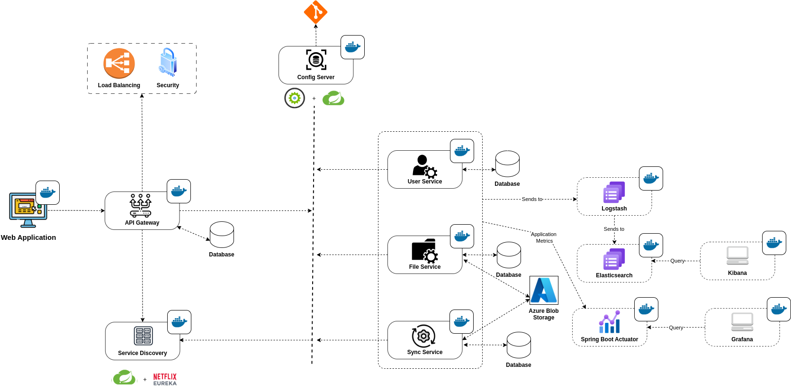

# 🌳 Oakcan

**Your friendly, all-in-one file management solution.** 
 

## About Oakcan
Oakcan is a file management system that allows users to upload, download, and manage files with ease. It provides a user-friendly web interface and robust features to ensure a seamless experience.

## Wiki, API Docs, and Project Management Tools

## Tech Stack 

## Code Analysis and Quality

 
     

 

 

## Meet The Team

> *"Alone we can do so little; together we can do so much." – Helen Keller*

<table style="width: 90%;">
    <tr>
      <td align="center" width="24%">
        <h4  style="white-space: nowrap; font-size: 16px; padding: 0 5px;">Rohit Roy</h4>
         
          
      </td>
      <td style="min-width: 220px;"  align="center" width="30%">
          <h4 style="white-space: nowrap; font-size: 16px; padding: 0 5px;">Tajbir Ahmed</h4>
            
         
      </td>
      <td align="center" width="25%">
        <h4 style="white-space: nowrap; font-size: 16px; padding: 0 5px;">Kazi Omar Sharif</h4>
         
         
      </td>
      <td align="center" width="20%">
        <h4 style="white-space: nowrap; font-size: 16px; padding: 0 5px;">Shahidullah Tasin</h4>
           
        
    </tr>
  </table>

## 📸 Project Description
Oakcan is a robust microservice-based file management platform designed for scalable and secure file operations. It enables efficient file upload/download, synchronization across devices, user management, and email-based notifications, making it ideal for cloud-native ecosystems.

### Key Features
- **File Operations**
    - **Resumable Uploads**
    - **Resumable Downloads**
    - **Sync, and Delete**
- **Folder Operations**
    - **Create, Rename, Move, List, and Delete**
- **File and Folder Sharing**
    - **Direct Sharing:** Users can directly add other users with specific permissions
        - **View Only, Edit, and Comment**
    - **Shareable Links**
        - **Role Based Permission**
        - **Password Protection**
        - **Expiration Date**

 and many more...

### 🗺️ System Architecture

