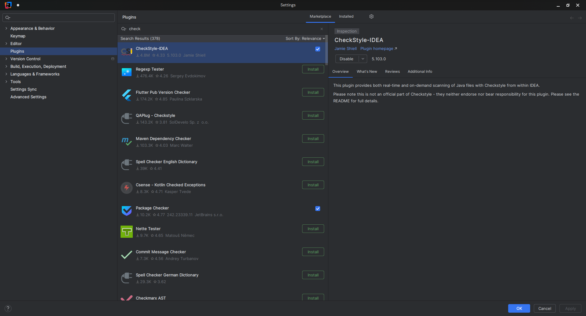
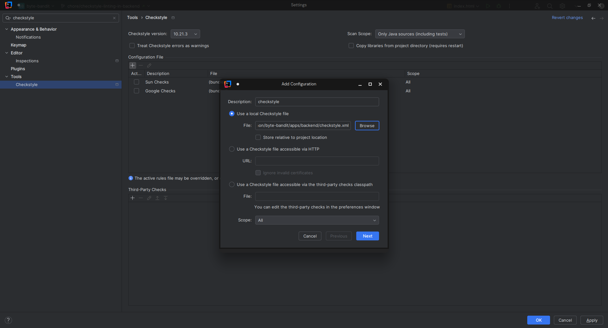
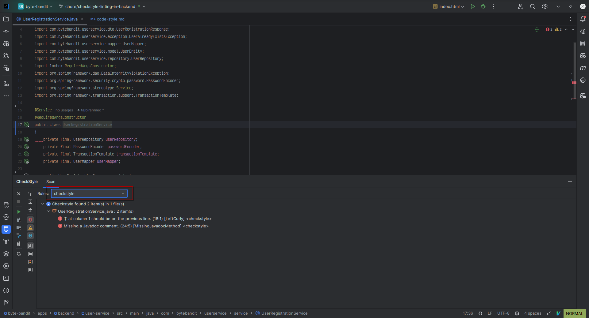
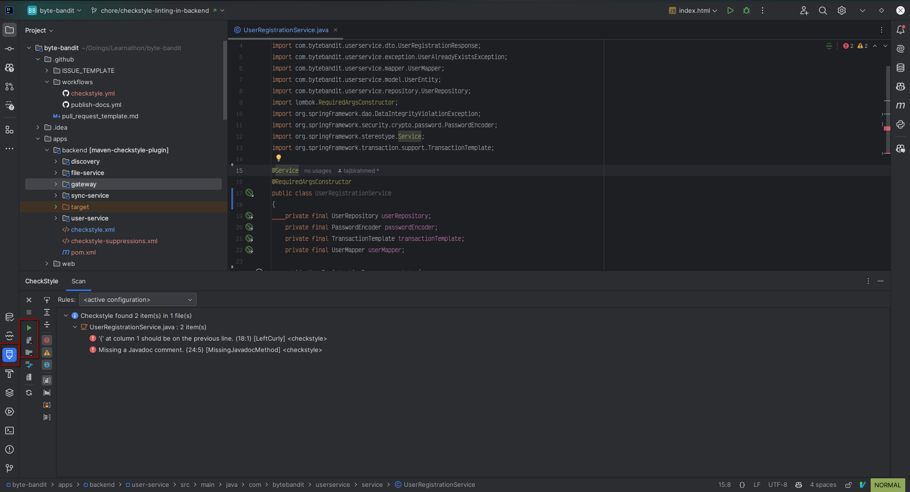
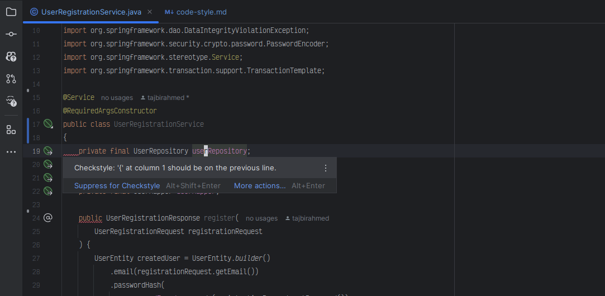
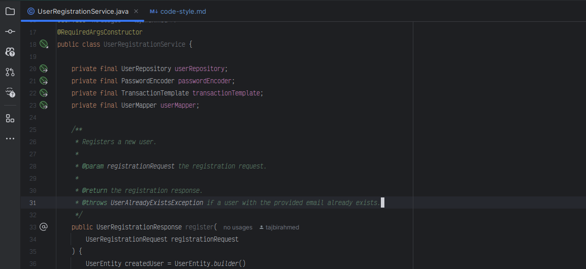
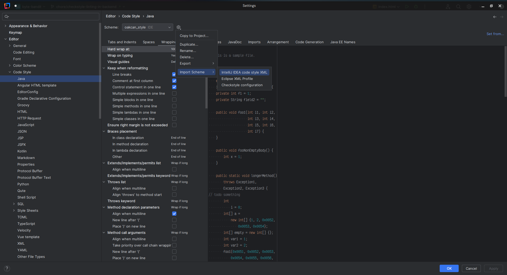
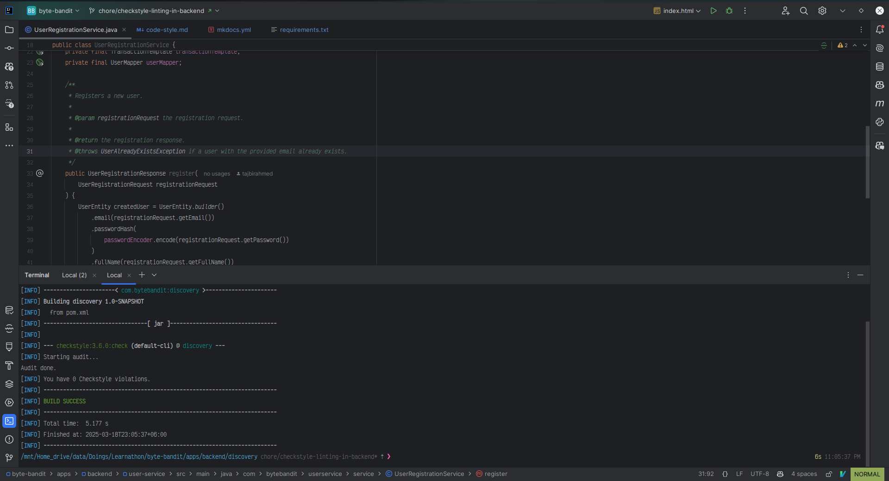

# Code Style Guideline

To maintain code quality and consistency across the project, we follow a set of coding standards and guidelines. This
page explains how we enforce coding standards using [Checkstyle](https://checkstyle.org/) with the
modified [Google Java Style](https://google.github.io/styleguide/javaguide.html) configuration based on the project
needs.

## Checkstyle

Checkstyle is a static code analysis tool used to ensure compliance with a defined coding style. We use it to enforce
the **Google Java Style Guide** with some project-specific modifications.

### Why Use Checkstyle?

- Ensures consistent coding style across the project.
- Helps maintain readability and maintainability.
- Prevents bad practices and enforces formatting rules.

### How Checkstyle Works

Checkstyle enforces coding rules defined in an XML configuration file. It scans the source code and generates a report
highlighting any violations of the defined rules. You can run Checkstyle from the command line or use the IntelliJ IDEA
plugin to check your code.

Example **checkstyle.xml** rule snippet:

```xml

<module name="JavadocMethod">
    <property name="accessModifiers" value="public"/>
    <property name="allowMissingParamTags" value="true"/>
    <property name="allowMissingReturnTag" value="true"/>
    <property name="allowedAnnotations" value="Override, Test"/>
    <property name="tokens" value="METHOD_DEF, CTOR_DEF, ANNOTATION_FIELD_DEF"/>
</module>
```

This Checkstyle configuration enforces Javadoc for public methods while allowing missing @param and @return tags. It
also skips methods annotated with @Override and @Test from Javadoc checks.

We've modified the Google Java Style Guide to suit our project needs. You can find the project-specific Checkstyle rules
in the **`checkstyle.xml`** file.

## Setting Up IntelliJ IDEA

There is two parts of the setup, firstly you need to install the
[`CheckStyle-IDEA`](https://plugins.jetbrains.com/plugin/1065-checkstyle-idea) plugin and then configure it to use the
project-specific Checkstyle configuration(`checkstyle.xml`) given inside `backend` directory. This will allow IntelliJ
IDEA to highlight any code that doesn't comply with the Checkstyle rules.
And then you need to configure the code style settings in intellij to match the Checkstyle rules. For consistency, we've
provided
the project-specific code style settings in the **`oakcan-code-style.xml`** file inside the `.idea` directory.

### Installing and Using CheckStyle-IDEA Plugin

1. Install Checkstyle Plugin: Preferences > Plugins > Search Checkstyle > Install `CheckStyle-IDEA`.
   
2. Restart IntelliJ IDEA.
3. Go to Preferences > Tools > Checkstyle.
4. Add a new configuration: Click + > Select checkstyle.xml from the backend folder. Give a name to the configuration(
   e.g. `checkstyle`).
   
5. Set it as active.
6. In the toolbar window, click on the Checkstyle icon, and make sure the `checkstyle` is selected in the dropdown.
   
7. Run Checkstyle Analysis: Then you can run checkstyle analysis by clicking on different scope options like
   `Check Current file`, `Check Project`, `check Module`, `Check All Modified Files`, etc.
   
8. Checkstyle will highlight any code that doesn't comply with the Checkstyle rules.
   
9. Now you can fix the issues by following the Checkstyle rules.
   

### Setting Up Code Style

To make sure your intellij code style settings match the Checkstyle rules, you need to import the project-specific code
style settings. Follow the below steps to import the code style settings:

1. Go to Preferences > Editor > Code Style.
2. Click on the gear icon and select `Import Scheme > IntelliJ IDEA code style XML`.
   
3. Select the `oakcan-code-style.xml` file from the `.idea/codeStyles/` directory.
4. Click on `OK` and `Apply`.
5. Now your code style settings are updated to match the Checkstyle rules.

Now you can format your code using `Cmd + Alt + L` or `Ctrl + Alt + L` on Windows/Linux. This will format your code
according to the Checkstyle rules.

## Running Checkstyle from Command Line

To run Checkstyle from the command line, you need to install
the [maven-checkstyle-plugin](https://maven.apache.org/plugins/maven-checkstyle-plugin/usage.html). We've already added
the plugin to the `pom.xml` file inside `backend` directory with proper configuration. You can run Checkstyle using the following command:

```shell
mvn checkstyle:check
```

<figure markdown="span">

<figcaption>Checkstyle successfully run on the `discovery` service.</figcaption>
</figure>

This will run Checkstyle on the current module and generate a report in the `target` directory. If you run this command
from the `backend` module, it'll check every module in the backend module and generate a report for each module.

!!! warning "Note"
      Make sure your code complies with the Checkstyle rules before committing your changes. You can run Checkstyle from
      the command line or use the IntelliJ IDEA plugin to check your code. Remember, we'll reject any pull requests that do
      not comply with the Checkstyle rules as it helps maintain code quality and consistency.

## SonarQube

We recommend to use [SonarQube](https://plugins.jetbrains.com/plugin/7973-sonarqube-for-ide) plugin locally to check the
code quality during development. It will help you to identify the code smells, bugs, and security vulnerabilities in the
code. We'll also use SonarCloud in the CI/CD pipeline to check the code quality of code changes so it's better to check the
code quality locally before pushing the code.

!!! tip
      If you get any unwanted errors from checkstyle, don't know how to fix them, write a comment in the code and push it. We
      will help you to fix it before merging the code.


## References

- [Checkstyle](https://checkstyle.org/)
- [Google Java Style Guide](https://google.github.io/styleguide/javaguide.html)
- [CheckStyle-IDEA Plugin](https://plugins.jetbrains.com/plugin/1065-checkstyle-idea)


