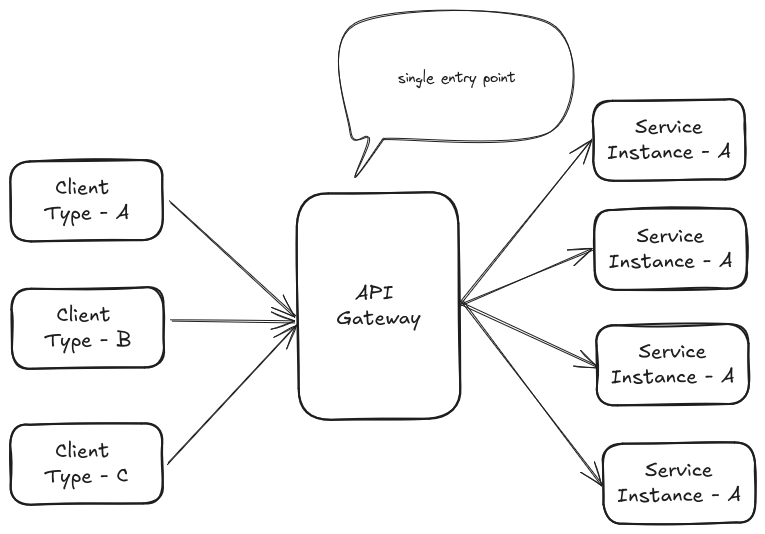

##  API Gateway in Microservice Architecture

In a microservices setup, each service handles a handful of specialized tasks. Clients—whether 
web apps, mobile apps, or other services need to interact with these services to fulfill requests. 
However, managing direct connections to each service can become complex as the number of services grows. 
This is where an API Gateway steps in, which simplifies client interactions 
and manages communication with the downstream services.

## The Problem

In a microservices architecture, each service is a standalone component, often deployed across multiple servers 
or containers, possibly in different data centers or cloud regions. These services expose their own APIs, 
which clients need to access to fulfill requests. Without a centralized mechanism, managing the interactions 
among services becomes a significant challenge, making the system hard to scale and maintain.

## A Naive Solution: Direct Client-to-Service Communication

Initially, one might consider having clients communicate directly with each microservice. In a monolithic 
application, all functionality is accessed through a single interface, so this approach seems straightforward. 

## Why API Gateway? The Central Hub for Accessing Microservices

An API Gateway acts as a single entry point for all client requests, routing them to the appropriate microservices. 

It simplifies client interactions and centralizes common functionality, offering several key benefits:

- **Simplified Client Interaction**: Clients only need to know the API Gateway’s address, not the locations of 
individual services, reducing coupling and simplifying client code.

- **Request Routing**: The gateway routes requests to the correct services based on defined rules, integrating with 
service discovery mechanisms like Eureka to handle dynamic service locations.

- **Security**: It enforces authentication and authorization policies, ensuring only authorized clients access the 
services, and centralizes security management.

- **Protocol Translation**: The gateway can translate between client-facing protocols (e.g., HTTP/REST) and 
internal service protocols (e.g., gRPC), allowing services to use their preferred communication methods.

- **Response Aggregation**: For requests requiring data from multiple services, the gateway can aggregate 
responses, reducing the number of calls the client needs to make and improving performance.

- **Cross-Cutting Concerns**: It handles tasks like rate limiting, caching, logging, monitoring, and 
circuit breaking, which would otherwise need to be implemented in each service.

## Internal Workings of API Gateway

Let’s dive into how an API Gateway functions, breaking down its key components and processes.

1. **Request Reception**: The API Gateway receives incoming requests from clients, which can come from various sources, such as web browsers,
   mobile apps, or external services.

2. **Request Processing**: Upon receiving a request, the gateway processes it by, 
      - **Parsing and Validating**: Ensuring the request is well-formed and contains necessary information, such 
      as valid headers or parameters.
      - **Authentication and Authorization**: Verifying the client’s identity (e.g., via OAuth or JWT) and checking 
      permissions to access the requested resources.
      - **Rate Limiting**: Controlling the number of requests to prevent abuse or overloading of services.
      - **Caching**: Serving cached responses for frequently accessed resources to reduce latency and load on 
      backend services.

3. **Request Routing**: The gateway routes the request to the appropriate microservice based on predefined rules, which can be based on:
    - **Path**: For example, requests starting with /users are routed to the user service.
    - **Headers**: Specific headers, like Accept or custom headers, can determine the target service.
    - **Query Parameters**: Parameters in the URL can indicate which service to use.

4. **Service Communication**: The gateway communicates with microservices using their internal protocols, which may 
differ from the client-facing protocol. For example, clients might use HTTP/REST, while services use gRPC or 
message queues. The gateway handles protocol translation to ensure seamless communication.

5. **Response Aggregation**: If a request requires data from multiple services (e.g., fetching user 
details and order history), the gateway can make multiple calls and aggregate the responses into a 
single response for the client, reducing network overhead.

6. **Response Processing**: Before sending the response back to the client, the gateway may:
    - **Transform the Response**: Convert the service’s response format (e.g., JSON to XML) to match the client’s expectations.
    - **Add Headers**: Include additional information, such as caching instructions or security tokens. 
    - **Handle Errors**: Manage errors from services and present them in a consistent format to clients.
7. **Logging and Monitoring**: The gateway logs requests and responses, providing data for monitoring system 
health, performance, and usage patterns. It can also integrate with tools like Prometheus or Zipkin for metrics and tracing.

## Why We Used Spring Cloud Gateway MVC

In our microservices-based application, built with Spring Boot, we chose Spring Cloud Gateway for several reasons:

- **Seamless Integration with Spring Boot**: Spring Cloud Gateway integrates effortlessly with our Spring Boot 
ecosystem, leveraging auto-configuration and shared dependencies, as noted in Spring Cloud Gateway— An Introduction.
- **Rich Feature Set**: It offers routing based on predicates, filters for request/response manipulation, and 
integration with Spring Cloud components like Eureka for service discovery and Spring Cloud Config for distributed 
configuration.

### Alternatives to Spring Cloud Gateway MVC

1. [Spring Cloud Gateway](https://spring.io/projects/spring-cloud-gateway)
2. [Kong Api Gateway](https://www.codecentric.de/en/knowledge-hub/blog/spring-boot-kong)

## References 

1. [Pattern: API Gateway / Backends for Frontends](https://microservices.io/patterns/apigateway.html)
2. [API gateway pattern](https://www.solo.io/topics/api-gateway/api-gateway-pattern)
