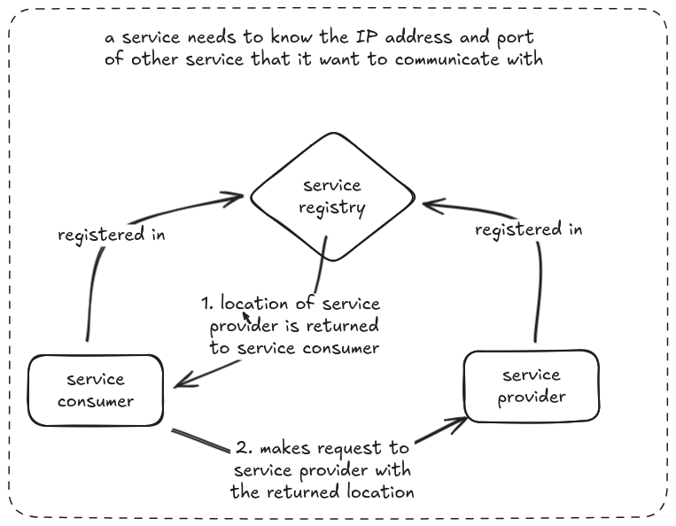
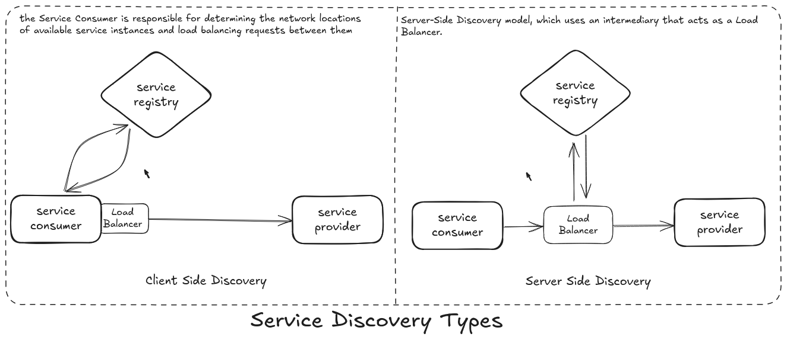

## Service Discovery in Microservice Architecture 

Imagine you’re building a ton of microservices(umm who uses monolith these days btw?), each one a small, independent 
unit handling a specific task—user authentication, payment processing, order management, etc. 
How do these independent services find and talk to each other in a dynamic, ever-changing environment? 
This is where service registry pattern plays a crucial role.

## The Problem 

In a microservices architecture, each service is a standalone component, often deployed across multiple servers 
or containers, possibly in different data centers or cloud regions. These services often need to communicate to 
fulfill user requests—like when the order service needs to verify a user’s identity through the authentication 
service or fetch inventory details from the inventory service. But here’s the catch: in a dynamic environment, 
services aren’t static. They scale up or down, get redeployed to new servers, or fail unexpectedly. Their 
network locations (IP addresses and ports) change frequently.

Without a way to dynamically locate services, communication breaks down. For instance, if the order service 
tries to call the authentication service at a hardcoded IP address that’s no longer valid, the request fails. 
Similarly, if a service scales to multiple instances to handle increased load, how does the calling service know 
which instance to contact? Manual updates to track these changes are impractical, especially in a system with 
dozens or hundreds of services. This creates a significant challenge: how do services reliably find and communicate 
with each other in a constantly changing environment?

## A Naive Solution

The initial instinct is to hardcode the network addresses of services. For example, we could embed the authentication 
service’s address (i.e. `192.168.1.10:8080`) directly into the order service’s code. It seems straightforward. 
But this approach quickly falls apart. When the authentication service will move to a new server or be scaled to multiple
instances. 

Next, lets say we use configuration files to store service addresses. Each service could read the locations 
of other services from a central config file. While this was slightly better than hardcoding, it still required 
manual updates whenever a service’s location changed. 

## Why Service Discovery? The Key to Seamless Communication

Service discovery act as a dynamic directory for microservices. Instead of relying 
on static addresses or manual updates, service discovery allows services to register their locations and query 
for the locations of other services in real time.

Service discovery solves several critical problems:

- **Dynamic Updates**: Services can register their current network locations (IP and port) when they start and 
        deregister when they shut down, ensuring the directory is always up-to-date.  
- **Scalability**: As services scale to multiple instances, discovery mechanisms provide clients with a list of 
      available instances, enabling load balancing.

- **Resilience**: If a service instance fails, the registry removes it, preventing clients from sending requests to 
dead endpoints.

- **Decoupling**: Services don’t need to know each other’s exact locations, reducing tight coupling and simplifying 
maintenance.

## Why We Used "spring-cloud-starter-netflix-eureka-server"

We opted for "spring-cloud-starter-netflix-eureka-server" because it integrates smoothly with Spring Boot, 
making it simple to set up a service registry. Eureka, developed by Netflix, is mature and widely used, 
providing features like service registration, discovery, and health checks. Its high availability through 
clustering and ease of use, especially with Spring Boot’s auto-configuration, made it a reliable choice 
for our microservices.

## Introduction to Spring Cloud Netflix Eureka

In the original service discovery pattern, there are two types of discovery, 

1. Client-side Discovery 
2. Server-side Discovery

Below, is the flow diagram for both is given, 

### Alternatives to Eureka

- [**Consul**](https://docs.spring.io/spring-cloud-consul/reference/discovery.html): Offers service discovery and configuration, ideal for language-agnostic setups.
- [**Apache ZooKeeper**](https://docs.spring.io/spring-cloud-zookeeper/reference/discovery.html): Good for distributed systems but more complex to configure.
- [**Kubernetes Service Discovery**](https://docs.spring.io/spring-cloud-kubernetes/reference/spring-cloud-kubernetes-discoveryserver.html): Built-in for Kubernetes environments, using DNS for discovery.

## References
1. [Pattern: Service registry](https://microservices.io/patterns/service-registry.html)
2. [Service Discovery in Microservices](https://www.baeldung.com/cs/service-discovery-microservices)