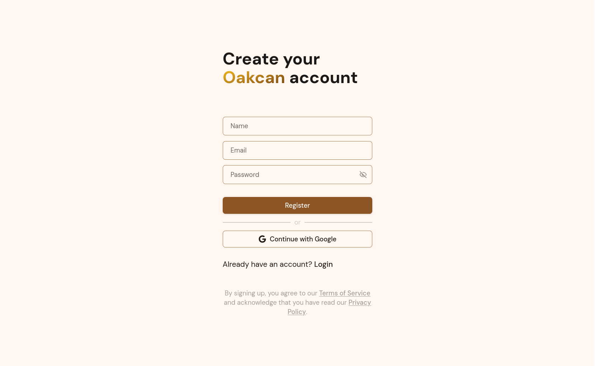
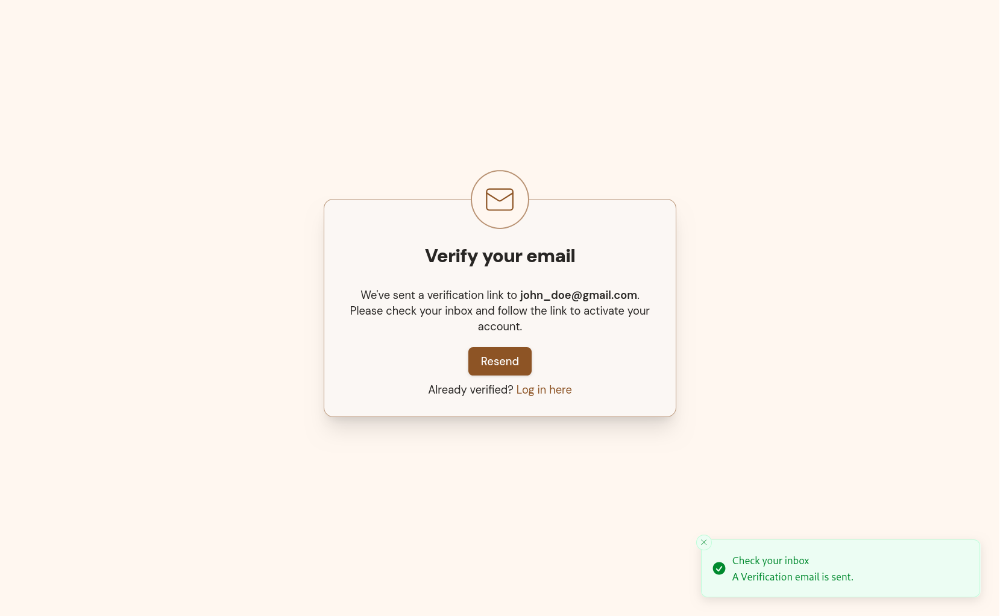
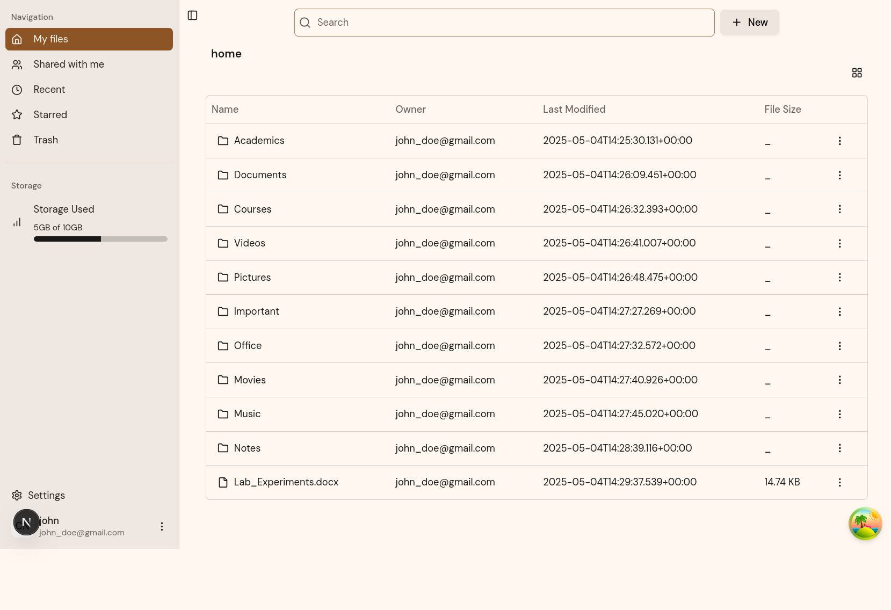
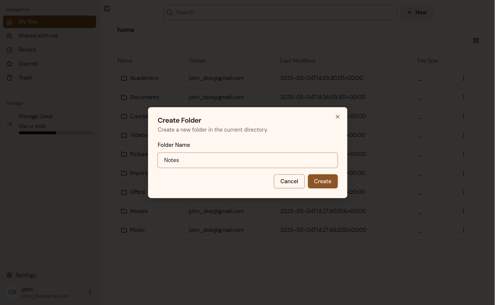

# Application Screenshots

This page showcases the visual interface and user experience of the Oakcan file management platform. Each screenshot demonstrates key features and workflows of the application.

## User Authentication & Registration

### Registration Page

The user registration interface provides a clean, modern design for account creation. Users can sign up using either email/password or Google OAuth2 integration. The form includes validation feedback and clear instructions for secure password requirements.

**Key Features:**
- Email and password registration
- Google OAuth2 integration
- Form validation with user feedback

---

### Email Verification

The email verification page confirms successful account activation after users click the verification link sent to their email address. This ensures account security and validates user email addresses.

**Key Features:**
- Clear verification confirmation
- Success message display
- Redirect to login functionality

---

## File Management Interface

### My Files Dashboard

The main file management interface provides users with a comprehensive view of their file system. The table-based layout shows file details including name, size, type, and last modified date.

**Key Features:**
- Hierarchical file structure navigation
- File and folder listing in table format
- File metadata display (size, type, modified date)
- Action menus for file operations
- Breadcrumb navigation

---

### New Folder Creation

The folder creation dialog allows users to create new directories within their file system. The interface provides a simple form for naming and placing new folders.

**Key Features:**
- Folder naming input
- Form validation
- Cancel and create actions

---

## Getting Started

To see these features in action:
1. [Set up the project locally](./local-setup.md)
2. [Run the application](./usage.md)
3. [Explore the API documentation](../api/reference/gateway.md)
